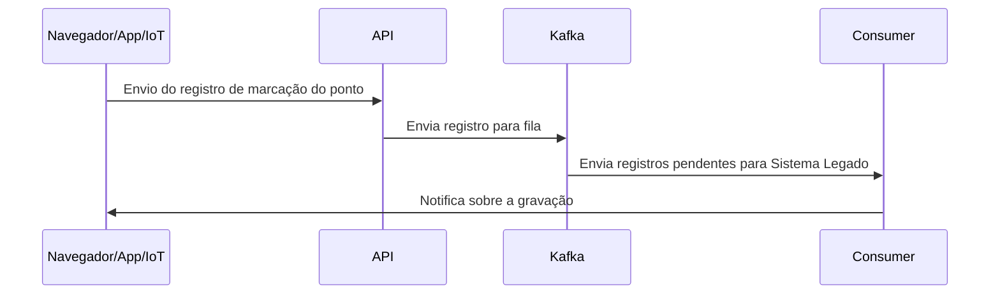

# HCM

## Solução
Aplicação desenvolvida para servir como gateway entre as aplicações frontend de marcação de ponto e o sistema legado da companhia.
Através de uma API em NodeJS, é possível tratar milhares de requisições com um tempo de resposta muito menor do que o sistema legado é capaz de responder. Juntamente com a fila criada com o Apache Kafka, milhares de requisições são recebidas e enviadas conforme a disponibilidade para a API legada, sem atrasos de resposta para o usuário, que terá a confirmação logo após o recebimento da primeira API.
 

## Execução
1. Clone o repositório em sua máquina
2. Execute pelo Docker Compose 
	```bash
	docker-compose up
	```
3. Acesse ``http://localhost:8000`` em seu navegador para simular o uso da API

Um exemplo pode ser acessado [aqui](http://hcm.guilhermesperb.com.br)

## Fluxo de Execução
